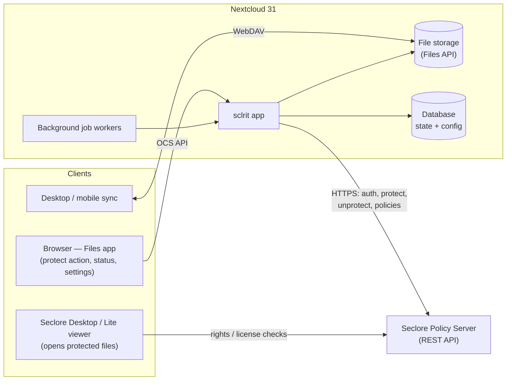
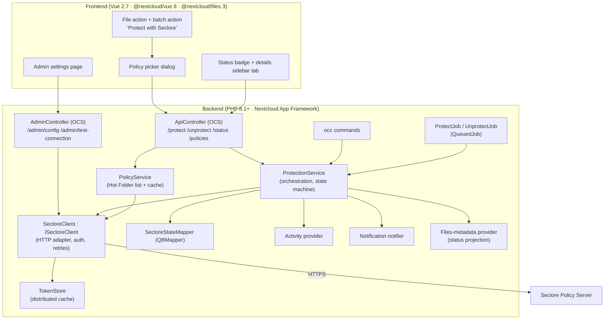
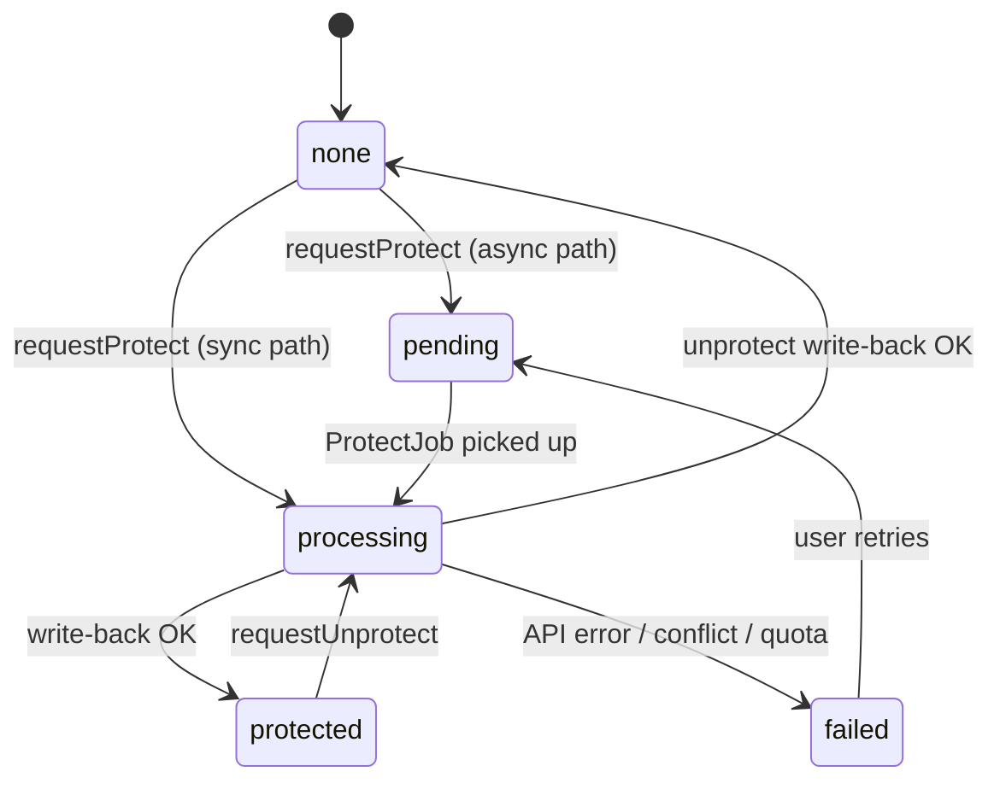
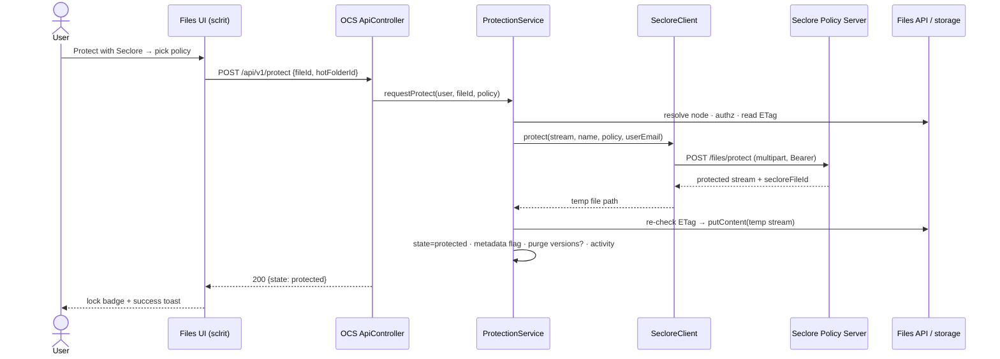

# Software Design Document

## Seclore File Protection for Nextcloud (`sclrit`)

| | |
| --- | --- |
| **App ID** | `sclrit` |
| **Target platform** | Nextcloud 31 (Hub 10) |
| **Document status** | Draft v0.1 |
| **Date** | 2026-07-08 |
| **Authors** | — |

---

## Table of contents

1. [Introduction](#1-introduction)
2. [System overview](#2-system-overview)
3. [Architecture](#3-architecture)
4. [Backend detailed design](#4-backend-detailed-design)
5. [Frontend detailed design](#5-frontend-detailed-design)
6. [Data design](#6-data-design)
7. [Seclore integration contract](#7-seclore-integration-contract)
8. [Security and privacy](#8-security-and-privacy)
9. [Failure handling and edge cases](#9-failure-handling-and-edge-cases)
10. [Performance and capacity](#10-performance-and-capacity)
11. [Observability](#11-observability)
12. [Testing strategy](#12-testing-strategy)
13. [Packaging, deployment and operations](#13-packaging-deployment-and-operations)
14. [Future enhancements](#14-future-enhancements)
15. [Open questions](#15-open-questions)
16. [Appendices](#appendix-a--configuration-keys)

---

## 1. Introduction

### 1.1 Purpose

This document describes the design of **Seclore File Protection** (`sclrit`), a Nextcloud 31 app that lets users protect files stored in Nextcloud **on demand** using [Seclore](https://www.seclore.com) Enterprise Digital Rights Management (EDRM). Protection is applied by the Seclore Policy Server through its REST API; the resulting rights-managed file replaces the original content in Nextcloud. Usage rights (view, edit, print, copy, screen capture, validity period, watermarking, …) then travel with the file and are enforced by Seclore clients wherever the file goes — including after it leaves Nextcloud via download, sync, or sharing.

### 1.2 Scope

**In scope (v1):**

- On-demand protection of a file, triggered by:
  - a file action in the Files web UI (single file and multi-select),
  - an OCS REST endpoint (for scripting/automation),
  - an `occ` CLI command (for administrators).
- Selection of a Seclore protection policy ("Hot Folder") at protect time, with an admin-configured default.
- Synchronous protection for small files; queued background protection for large files.
- Protection status tracking, visible in the Files UI (badge + details tab) and queryable via API.
- Unprotection of a file, restricted to configurable groups.
- Admin settings: Policy Server connection, credentials, defaults, size thresholds, group-based access control, connection test.
- Audit trail via the Activity app and structured server logs.
- Notifications for completed/failed background protections.

**Out of scope (v1):**

- Automatic/rule-based protection (on upload, on tag, on share) — see [§14 Future enhancements](#14-future-enhancements).
- Rendering or previewing Seclore-protected content inside Nextcloud (protected files are opaque to the server; they are opened with Seclore Desktop/Lite clients).
- Any local implementation of the Seclore file format or cryptography — all protection/unprotection is performed by the Seclore Policy Server.
- Policy authoring/management — policies are created and maintained in the Seclore admin console; the app only consumes them.
- Federated (server-to-server) shares and end-to-end-encrypted (E2EE) folders.

### 1.3 Definitions and abbreviations

| Term | Meaning |
| --- | --- |
| **EDRM** | Enterprise Digital Rights Management: persistent, file-embedded usage policies. |
| **Policy Server** | The Seclore server component that authenticates, applies protection, issues licenses, and hosts the REST API. On-premises or Seclore cloud. |
| **Hot Folder** | Seclore's container for a protection policy: a predefined set of users/groups and usage permissions. Protecting "into" a Hot Folder applies that policy. Referred to as *policy* in the UI. |
| **Protected file** | A file wrapped in Seclore's encrypted format. Opaque binary from Nextcloud's point of view. |
| **OCS** | Open Collaboration Services — Nextcloud's authenticated REST API convention (CSRF-safe, capability-discoverable). |
| **Node / fileId** | Nextcloud Files API object and its immutable numeric id (stable across renames/moves). |
| **ETag** | Content-version identifier of a Nextcloud file; changes on every write. |

### 1.4 References

- Nextcloud developer documentation — <https://docs.nextcloud.com/server/31/developer_manual/>
- Nextcloud app store publishing & signing — <https://nextcloudappstore.readthedocs.io/>
- `@nextcloud/files` file actions API — <https://nextcloud-libraries.github.io/nextcloud-files/>
- Seclore Policy Server REST API documentation — *licensed document, version to be confirmed with the customer's Seclore deployment; see [§7](#7-seclore-integration-contract) and [§15](#15-open-questions).*

### 1.5 Assumptions and constraints

| # | Assumption / constraint |
| --- | --- |
| A1 | A Seclore Policy Server is reachable from the Nextcloud server over HTTPS. No inbound connectivity from Seclore to Nextcloud is required. |
| A2 | The organization registers this app on the Policy Server as an enterprise application and provisions API credentials (app ID + secret, or equivalent) with rights to protect/unprotect and list Hot Folders. |
| A3 | Nextcloud 31, PHP ≥ 8.1. The app declares `min-version="31" max-version="31"` initially. |
| A4 | Nextcloud users are identifiable to Seclore by email address (used for "protect on behalf of" ownership attribution, if the API supports it — see [§15](#15-open-questions)). |
| A5 | Protection replaces file content **in place**: same node, same name, new content. Seclore keeps the native file extension for supported formats (behavior to be confirmed per deployment — see [§15](#15-open-questions)). |
| A6 | The server can hold a temporary copy of the file during protection (disk, not RAM — all transfers are streamed). |
| A7 | Files in E2EE folders cannot be protected (the server cannot read their plaintext). Server-side encryption is transparent to the Files API and is supported. |

---

## 2. System overview

### 2.1 Context



Nextcloud is the system of record for the file; Seclore is the system of record for the policy and the rights enforcement. The app is the broker: it streams file content to the Policy Server, writes the protected result back over the original, and tracks state.

### 2.2 Personas and primary user stories

| Persona | Story |
| --- | --- |
| **End user** (member of an allowed group) | "I select a contract in the Files app, choose *Protect with Seclore*, pick the 'External legal' policy, and within seconds the file is protected. Anyone I share it with is bound by that policy." |
| **End user** | "I protected a 2 GB video. The UI told me it was queued; I got a notification when it finished." |
| **Compliance officer** (member of the unprotect group) | "I can remove protection from a file when legally required, and that action is audited." |
| **Administrator** | "I configure the Policy Server URL and credentials once, test the connection from the settings page, decide who may protect/unprotect, and see every operation in the audit trail." |
| **Automation engineer** | "A script calls the OCS endpoint to protect files that a workflow drops into a folder." |

### 2.3 Key design decisions

| # | Decision | Alternatives considered / rationale |
| --- | --- | --- |
| D1 | **Replace content in place** (same node/fileId/name). | *Keep original + create protected copy*: rejected — leaving an unprotected original defeats the purpose of DRM and doubles storage. In-place keeps shares, links, and sync relationships intact. |
| D2 | **All crypto is delegated to the Seclore Policy Server.** The app never implements the Seclore format. | Local SDK/agent integration: heavier operational footprint, platform-specific binaries; REST keeps the app pure-PHP and portable. |
| D3 | **Adapter interface (`ISecloreClient`) isolates the Seclore API contract.** Endpoint paths and payload shapes are confined to one class and integration-tested against the customer's Policy Server version. | Seclore's REST API is licensed documentation and varies by server version; hard-coding it throughout the app would make version drift expensive. |
| D4 | **Sync for small files, queued background job above a size threshold** (default 25 MiB). | Always-async: simpler but poor UX for the common small-file case. Always-sync: PHP request timeouts and proxy limits make large files unreliable. |
| D5 | **Database table is the authoritative protection state**; Files-metadata / frontend badge is a denormalized projection. | Relying on Seclore "file info" probes per listing would be slow and chatty; relying on content sniffing is fragile. |
| D6 | **ETag compare-and-swap around the protect round-trip** to detect concurrent edits. | Long-held exclusive locks during the (potentially slow) Seclore round-trip would block sync clients; optimistic concurrency fails safe (abort, original intact). |
| D7 | **Optionally purge prior file versions after successful protection** (admin toggle, default ON). | Nextcloud's versions app retains the *unprotected* content as a previous version — a direct leak of the data DRM was meant to lock down. Purging is a deliberate, documented trade-off against recoverability. |
| D8 | **Streaming end-to-end** (file → HTTP multipart → protected response → temp file → write-back). No full-file buffering in PHP memory. | Required for predictable memory use with large files. |

---

## 3. Architecture

### 3.1 Component view



### 3.2 Technology stack

| Layer | Choice | Notes |
| --- | --- | --- |
| Backend | PHP 8.1+, Nextcloud App Framework (`OCP\AppFramework`) | Dependency injection via `Application::register()`; strict types; psalm level ≤ 4. |
| HTTP client | `OCP\Http\Client\IClientService` | Server-managed Guzzle: honors instance proxy settings and CA bundle; supports streamed bodies and multipart. |
| Persistence | `OCP\AppFramework\Db\QBMapper` + migrations (`SimpleMigrationStep`) | Must work on MySQL/MariaDB, PostgreSQL, SQLite (dev). |
| Caching | `OCP\ICacheFactory` distributed cache | Token + policy-list caching across web/cron workers. |
| Background work | `OCP\BackgroundJob\QueuedJob` + `IJobList` | Executed by system cron/ajax cron. |
| Frontend | Vue 2.7 + `@nextcloud/vue` 8.x, `@nextcloud/files` 3.x, `@nextcloud/axios`, `@nextcloud/dialogs` | Nextcloud 31 ships the Vue 2.7-based component line; the Vue 3 line (`@nextcloud/vue` 9) is not yet the platform default. |
| Build | Vite (`@nextcloud/vite-config`), TypeScript | Outputs `js/sclrit-main.mjs`, `js/sclrit-admin.mjs`. |
| i18n | `@nextcloud/l10n` / `OCP\IL10N` | All user-facing strings translatable. |

### 3.3 App skeleton

```text
sclrit/
├── appinfo/
│   ├── info.xml                  # id, dependencies (nextcloud 31), commands, settings
│   └── routes.php                # (or attribute-based routes on controllers)
├── lib/
│   ├── AppInfo/Application.php   # IBootstrap: DI wiring, listener/provider registration
│   ├── Controller/
│   │   ├── ApiController.php     # OCS: protect, unprotect, status, policies
│   │   └── AdminController.php   # OCS: config get/set, test-connection
│   ├── Service/
│   │   ├── ISecloreClient.php    # adapter contract (§7)
│   │   ├── SecloreClient.php     # HTTP implementation
│   │   ├── TokenStore.php        # token acquisition + distributed cache
│   │   ├── PolicyService.php     # Hot Folder listing + cache
│   │   ├── ProtectionService.php # orchestration + state machine
│   │   └── ConfigService.php     # typed access to app config (Appendix A)
│   ├── Db/
│   │   ├── SecloreState.php      # Entity
│   │   └── SecloreStateMapper.php
│   ├── BackgroundJob/
│   │   ├── ProtectJob.php
│   │   └── UnprotectJob.php
│   ├── Migration/
│   │   └── Version000100Date20260708000000.php
│   ├── Settings/
│   │   ├── AdminSettings.php     # ISettings → security section
│   │   └── AdminSection.php      # (only if a dedicated section is preferred)
│   ├── Activity/                 # provider + events for audit trail
│   ├── Notification/Notifier.php
│   ├── Command/
│   │   ├── Protect.php           # occ sclrit:protect
│   │   ├── Status.php            # occ sclrit:status
│   │   └── TestConnection.php    # occ sclrit:test
│   └── Exceptions/               # SecloreApiException, ConflictException, …
├── src/
│   ├── main.ts                   # Files app integration (actions, badge, sidebar tab)
│   ├── admin.ts                  # admin settings UI
│   └── components/               # PolicyPicker.vue, StatusTab.vue, AdminSettings.vue
├── templates/                    # minimal PHP templates mounting the Vue apps
├── tests/                        # phpunit unit + integration, cypress e2e (optional)
├── composer.json · package.json · vite.config.ts · psalm.xml
└── docs/
```

`appinfo/info.xml` (sketch):

```xml
<?xml version="1.0"?>
<info xmlns:xsi="http://www.w3.org/2001/XMLSchema-instance"
      xsi:noNamespaceSchemaLocation="https://apps.nextcloud.com/schema/apps/info.xsd">
    <id>sclrit</id>
    <name>Seclore File Protection</name>
    <summary>Protect files on demand with Seclore Enterprise DRM</summary>
    <description><![CDATA[Apply persistent Seclore usage policies to files directly from Nextcloud.]]></description>
    <version>0.1.0</version>
    <licence>agpl</licence>
    <category>files</category>
    <category>security</category>
    <dependencies>
        <php min-version="8.1"/>
        <nextcloud min-version="31" max-version="31"/>
    </dependencies>
    <commands>
        <command>OCA\Sclrit\Command\Protect</command>
        <command>OCA\Sclrit\Command\Status</command>
        <command>OCA\Sclrit\Command\TestConnection</command>
    </commands>
    <settings>
        <admin>OCA\Sclrit\Settings\AdminSettings</admin>
    </settings>
</info>
```

---

## 4. Backend detailed design

### 4.1 Protection orchestration (`ProtectionService`)

The service owns the end-to-end protect/unprotect flows and the state machine. Public contract:

```php
interface IProtectionService {
    /**
     * Protect a file on demand.
     * Runs synchronously when size <= sync_max_size, otherwise enqueues a ProtectJob.
     *
     * @throws NotFoundException|NotPermittedException|AlreadyProtectedException
     * @throws PolicyNotFoundException|SecloreApiException|ConflictException
     */
    public function requestProtect(string $userId, int $fileId, ?string $hotFolderId): ProtectionState;

    /** Restricted to members of unprotect_groups. Same sync/async split. */
    public function requestUnprotect(string $userId, int $fileId): ProtectionState;

    /** @param int[] $fileIds  @return array<int, ProtectionState> */
    public function getStates(string $userId, array $fileIds): array;
}
```

**Synchronous protect algorithm** (executed in-request or inside `ProtectJob`):

1. **Resolve** the node via `IRootFolder::getUserFolder($userId)->getFirstNodeById($fileId)`; require a `File` (not folder).
2. **Authorize**: caller is in `allowed_groups` (empty = everyone); node grants `PERMISSION_UPDATE`; node is not in an E2EE folder; storage is not read-only.
3. **Guard**: no existing state row in `pending|processing`; state is not already `protected` (unless the caller passed an explicit re-protect flag — v1: reject).
4. **Record** `etagBefore = $file->getEtag()` and insert/update the state row → `processing`.
5. **Stream out**: `$in = $file->fopen('rb')`; call `ISecloreClient::protect($in, $file->getName(), $hotFolderId, $ownerEmail)`. The client streams the multipart request and streams the response to a **temp file** (`ITempManager`), returning `{secloreFileId, tempPath, size}`.
6. **Conflict check**: refresh node; if `getEtag() !== $etagBefore` → abort with `ConflictException` (state → `failed`, reason `conflict`), delete temp file. The original is untouched.
7. **Write back**: `$file->putContent(fopen($tempPath, 'rb'))`. `putContent` takes the file lock internally, bumps the ETag/version, and triggers the usual propagation (activity, preview invalidation, sync).
8. **Post-write**: update state row → `protected` (store `seclore_file_id`, `hot_folder_id`, `protected_by`, timestamps); set the files-metadata flag (§4.5); if `purge_versions` is enabled, delete all pre-protection versions of the node (D7); publish an Activity event; on async completion, push a Notification.
9. **Cleanup**: temp file removed in a `finally` block regardless of outcome.

*Failure at any step before 7 leaves the original file byte-identical.* Failure during step 7 is the only critical window; `putContent` is atomic at the storage layer (write-then-rename on local storage), and the state row is only advanced after success.

**Unprotect** mirrors the flow with `ISecloreClient::unprotect()`, gated on `unprotect_groups` membership, and ends by clearing the state row and metadata flag. Unprotect is always audited with actor + file + previous policy.

**State machine:**



`failed` rows keep `last_error` (user-safe message) and `attempts`; the UI offers retry. Rows in `pending|processing` older than a watchdog window (default 6 h) are swept to `failed` by a periodic job, so crashed workers can't wedge a file forever.

### 4.2 Sync vs. async split

- `size <= sync_max_size` (default 25 MiB): protect inline in the OCS request; response `200` with final state. Keeps the common case to one round-trip with immediate UI feedback.
- Larger: insert state `pending`, `IJobList::add(ProtectJob::class, ['fileId' => …, 'userId' => …, 'hotFolderId' => …])`, respond `202` with state `pending`. The frontend shows "queued" and the user is notified on completion. Job arguments never contain file content or secrets.
- `ProtectJob` sets a generous execution budget (Seclore round-trip for multi-GB files), re-validates every guard from §4.1 (the file may have changed or been deleted since enqueueing), and marks `failed` with a retryable flag on transient errors (timeouts, 5xx) so users can retry; it does **not** auto-retry indefinitely (max 3 attempts with backoff).

### 4.3 OCS API

All routes are OCS (`OCSController`), CSRF-protected by the OCS token, under `/ocs/v2.php/apps/sclrit/`. Declared with route attributes (`#[ApiRoute]`); user endpoints carry `#[NoAdminRequired]` and rate limits (`#[UserRateLimit]`).

| Method & route | Body / params | Success response | Notes |
| --- | --- | --- | --- |
| `POST /api/v1/protect` | `{fileId: int, hotFolderId?: string}` | `200` `{state}` (sync) or `202` `{state}` (queued) | `hotFolderId` defaults to admin default. Errors: `403` not allowed / no edit permission, `404` file, `409` already protected or concurrent edit, `422` unknown policy, `502` Seclore error. |
| `POST /api/v1/unprotect` | `{fileId: int}` | `200/202` `{state}` | `403` unless caller in `unprotect_groups`. |
| `GET /api/v1/status` | `fileIds[]=1&fileIds[]=2` (≤ 200 ids) | `200` `{states: {fileId: state}}` | Used by the files list and sidebar. |
| `GET /api/v1/policies` | — | `200` `{policies: [{id, name, description}], defaultId}` | Served from `PolicyService` cache. |
| `POST /api/v1/retry` | `{fileId: int}` | `202` `{state}` | Re-enqueue a `failed` row (owner or original requester). |
| `GET /api/v1/admin/config` | — | `200` config (secret masked) | Admin only. |
| `PUT /api/v1/admin/config` | partial config object | `200` | Admin only; secret only overwritten when a new value is supplied. |
| `POST /api/v1/admin/test-connection` | optional trial credentials | `200` `{ok, serverVersion?, error?}` | Authenticates + lists policies; never persists trial credentials. |

`state` object: `{fileId, status, hotFolderId?, policyName?, secloreFileId?, requestedBy?, updatedAt, error?}`.

The app also registers a **capability** (`OCP\Capabilities\ICapability`) advertising `sclrit: {enabled, canProtect, canUnprotect, defaultPolicy}` so clients and scripts can discover availability per user.

### 4.4 `occ` commands

| Command | Behavior |
| --- | --- |
| `occ sclrit:test` | Connection + auth + policy listing check; exit code for monitoring. |
| `occ sclrit:protect --user <uid> <path> [--policy <id>] [--recursive]` | Protect a file (or files under a folder with `--recursive`), synchronously, streaming progress. Intended for admin/batch use. |
| `occ sclrit:status [--failed]` | Tabular dump of state rows; `--failed` filters for triage. |

### 4.5 Files UI status projection

Authoritative state lives in the DB (§6). For cheap display in file lists, the app additionally writes a boolean flag through the **files metadata API** (`OCP\FilesMetadata\IFilesMetadataManager`, available since NC 28): key `sclrit-protected`. Metadata is exposed on WebDAV PROPFIND, which lets the web UI (and future clients) render a badge without extra round-trips. If the metadata subsystem is unavailable, the frontend falls back to batched `GET /status` calls; the feature degrades, it doesn't break.

### 4.6 Settings, activity, notifications

- **AdminSettings** (`ISettings`) renders into the existing **Security** admin section: connection form (URL, app ID, secret), default policy dropdown (populated live via test connection), thresholds, group selectors (using `NcSelect` with the groups provider), toggles (`verify_tls`, `purge_versions`), and a *Test connection* button wired to the admin endpoint.
- **Activity**: events `file_protected`, `file_unprotected`, `protect_failed` with actor, file, and policy name; visible in the file's activity stream and the owner's feed. This doubles as the user-facing audit trail; the admin_audit log receives the same events via `ILogger` structured entries (§11).
- **Notifications**: pushed for async completion/failure (`INotifier`), deep-linking to the file.

---

## 5. Frontend detailed design

### 5.1 Files app integration (`src/main.ts`)

- **File action** registered with `registerFileAction(new FileAction({...}))` from `@nextcloud/files`:
  - `id: 'sclrit-protect'`, display name *"Protect with Seclore"*, inline SVG lock icon.
  - `enabled(nodes, view)`: every node is a file (v1: no folders), user capability `canProtect`, node has `PERMISSION_UPDATE`, node not already `protected|pending|processing`, not inside an E2EE folder, view is not trashbin/versions.
  - `exec(node)` opens the **policy picker**; `execBatch(nodes)` runs the same picker once and fires one `POST /protect` per node (bounded concurrency of 3, progress toast, per-file error surfacing).
- **Unprotect action** (`sclrit-unprotect`) shown only when capability `canUnprotect` and state is `protected`; requires an explicit confirmation dialog.
- **Retry action** shown on `failed` state.

### 5.2 Policy picker dialog

`NcDialog` + `NcSelect` listing policies from `GET /policies` (client-cached for the session). Pre-selects the admin default; remembers the user's last choice in `localStorage` as a convenience (never as authorization). Shows policy description text so users understand what rights they are applying. Confirm button label: *"Protect 3 files"* (count-aware).

### 5.3 Status surfaces

- **Badge**: protected files get a lock overlay on the file icon (driven by the metadata flag from §4.5); `pending/processing` shows a subtle spinner badge; `failed` a warning badge.
- **Details sidebar tab** ("Seclore"): status, policy name, protected by/at, Seclore file id, and contextual actions (retry / unprotect). Data from `GET /status`.
- Toasts via `@nextcloud/dialogs` for immediate feedback (`showSuccess` / `showError` / `showInfo` for queued).

### 5.4 Admin settings (`src/admin.ts`)

Single Vue component mounted into the settings template. Secret input is write-only (placeholder "•••• saved" when set). *Test connection* exercises the currently entered (unsaved) values so admins can validate before committing. All mutations go through the admin OCS endpoints; nothing sensitive is embedded in the page at render time.

### 5.5 Accessibility & i18n

All dialogs and actions use `@nextcloud/vue` components (keyboard/focus management included); icons have text labels; status is never conveyed by color alone (badge shape + tooltip text). Every string goes through `t('sclrit', …)`.

---

## 6. Data design

### 6.1 Table `oc_seclore_state`

One row per file that has ever been protected or has an in-flight/failed request.

| Column | Type | Constraints | Purpose |
| --- | --- | --- | --- |
| `id` | bigint | PK, autoincrement | — |
| `file_id` | bigint | **unique**, indexed | Nextcloud file id (stable across rename/move). |
| `status` | varchar(16) | not null | `pending` \| `processing` \| `protected` \| `failed`. (`none` = row absent.) |
| `seclore_file_id` | varchar(128) | nullable | Seclore's identifier for the protected file. |
| `hot_folder_id` | varchar(128) | nullable | Policy applied / requested. |
| `policy_name` | varchar(255) | nullable | Snapshot for display/audit (policy may be renamed later in Seclore). |
| `requested_by` | varchar(64) | not null | Nextcloud uid of the actor. |
| `attempts` | smallint | default 0 | Background retry accounting. |
| `last_error` | text | nullable | User-safe failure summary. |
| `etag_before` | varchar(64) | nullable | Conflict detection across the async path. |
| `request_id` | varchar(32) | nullable | Correlation id of the last protect/unprotect attempt (§7.4). |
| `created_at` / `updated_at` | bigint (unix) | not null | Watchdog + display. |

Indexes: unique(`file_id`); (`status`, `updated_at`) for the watchdog sweep and `occ sclrit:status --failed`.

Lifecycle notes: rows are deleted on successful unprotect and by a repair step when the underlying file is permanently deleted (listener on `NodeDeletedEvent` — trashbin deletion keeps the row until final purge, so restore-from-trash retains status).

### 6.2 App configuration

Stored via `IAppConfig`; the secret is stored with the **sensitive** flag (masked in `occ config:list` and encrypted at rest on current server releases). Full key table in [Appendix A](#appendix-a--configuration-keys).

---

## 7. Seclore integration contract

### 7.1 Adapter interface

```php
interface ISecloreClient {
    /** Validates connectivity + credentials. Never throws for "expected" failures. */
    public function testConnection(?Credentials $override = null): ConnectionResult;

    /** @return HotFolder[]  id, name, description */
    public function listHotFolders(): array;

    /**
     * Stream $in to the Policy Server, receive the protected file streamed to a temp path.
     * @param resource $in
     * @param string|null $ownerEmail  acting user, for on-behalf-of attribution if supported
     */
    public function protect($in, string $fileName, string $hotFolderId, ?string $ownerEmail): ProtectResult;

    /** @param resource $in  @return string temp path of the unprotected file */
    public function unprotect($in, string $fileName): string;

    /** Optional probe: is this byte stream a Seclore-protected file? */
    public function getFileInfo($in): ?SecloreFileInfo;
}
```

### 7.2 Authentication and token lifecycle

The app authenticates as a registered **enterprise application** (app ID + secret) and receives a short-lived session token used as a bearer credential on subsequent calls. `TokenStore`:

- caches the token in the **distributed** cache (shared by web workers and cron) under a key derived from server URL + app ID, with TTL = `expires_in − 60 s`;
- serializes refresh with a cache-based mutex to avoid thundering-herd re-auth;
- on a `401` mid-flight, invalidates and refreshes **once**, then replays the request; a second `401` surfaces as a configuration error.

If the deployed Policy Server version uses HMAC request signing instead of bearer tokens, that variance is absorbed inside `SecloreClient` — no other component changes (decision D3).

### 7.3 Indicative endpoint mapping

> ⚠️ **The Seclore REST API is licensed documentation and versioned per deployment. The paths and payloads below are indicative placeholders to shape the adapter; they must be confirmed against the customer's Policy Server API guide before implementation** (tracked in [§15](#15-open-questions)). The base path is admin-configurable (`base_url`).

| Operation | Indicative call | Adapter method |
| --- | --- | --- |
| Authenticate app | `POST {base}/auth/token` `{appId, secret}` → `{token, expiresIn}` | `TokenStore` |
| List policies | `GET {base}/hotfolders` → `[{id, name, description}]` | `listHotFolders()` |
| Protect | `POST {base}/files/protect` — multipart: `file` (stream), `hotFolderId`, `ownerEmail?` → protected bytes (stream) + `X-Seclore-File-Id` header or JSON envelope | `protect()` |
| Unprotect | `POST {base}/files/unprotect` — multipart: `file` → original bytes | `unprotect()` |
| File info | `POST {base}/files/info` — first N KiB or full file → `{protected, fileId?, hotFolderId?}` | `getFileInfo()` |

### 7.3.1 Verified contract — Seclore DRM tenant API 1.0 (public sources, 2026-07-09)

The endpoints below were extracted from Seclore Professional Services' own public
[n8n integration node](https://repo.seclore.com/public/n8n-nodes-seclore)
(mirrored at [github.com/seclore-tech/n8n-nodes-seclore](https://github.com/seclore-tech/n8n-nodes-seclore),
v1.0.3, 2025-11). They describe the **Seclore cloud DRM tenant API**; an on-premises
Policy Server deployment must still be checked against this table (Q1).

| Operation | Verified call |
| --- | --- |
| Authenticate | `POST {base}/seclore/drm/1.0/auth/login` `{tenantId, tenantSecret}` → `{accessToken, refreshToken}` (no `expiresIn`) |
| Refresh token | `POST {base}/seclore/drm/1.0/auth/refresh` `{refreshToken}` (Bearer) → new token pair |
| Upload | `POST {base}/seclore/drm/filestorage/1.0/upload` — multipart field `file` → `{fileStorageId}` |
| Protect (Hot Folder) | `POST {base}/seclore/drm/1.0/protect/hf` `{hotfolderId, fileStorageId}` → `{fileStorageId (new), secloreFileId}` |
| Protect (external ref) | `POST {base}/seclore/drm/1.0/protect/externalref` `{hotfolderExternalReference, fileExternalReference?, fileStorageId}` |
| Protect (like existing file) | `POST {base}/seclore/drm/1.0/protect/fileid` `{existingProtectedFileId, fileStorageId}` |
| Unprotect | `POST {base}/seclore/drm/1.0/unprotect` `{fileStorageId}` → `{fileStorageId (new)}` |
| Download | `GET {base}/seclore/drm/filestorage/1.0/download/{fileStorageId}` → bytes (filename via response headers) |
| Delete stored file | `DELETE {base}/seclore/drm/filestorage/1.0/{fileStorageId}` |

Consequences for the adapter (all confined to `SecloreClient`/`TokenStore`, decision D3):

1. **Protect/unprotect are multi-step**, not one multipart round-trip: upload → operate → download, with `DELETE` cleanup of the uploaded temporary in a `finally`.
2. **Auth**: bearer `accessToken` plus a `refreshToken`; no expiry in the response, so the token cache needs a conservative TTL and the existing 401 refresh-and-replay path (re-login is a valid fallback for refresh).
3. **Correlation header** is `X-SECLORE-CORRELATION-ID` (not `X-Request-Id`).
4. **No Hot Folder listing endpoint** appears in this API — see Q1a below; the policy picker may need an admin-maintained policy list instead.
5. **No on-behalf-of user field** in any protect request (settles Q2 for this API) and **no file-info/probe endpoint** (settles Q6 negatively for this API).
6. Credentials terminology is `tenantId`/`tenantSecret` (our `app_id`/`app_secret` map 1:1).

### 7.4 Error mapping and resilience

| Seclore response | Mapped exception | User-facing behavior |
| --- | --- | --- |
| Network error / timeout | `SecloreUnavailableException` *(retryable)* | "Protection service unreachable — try again later." Async path retries with backoff (max 3). |
| `401/403` after one token refresh | `SecloreAuthException` | Admin-oriented error; logged at `error`; settings page shows failing test. |
| `404` policy | `PolicyNotFoundException` | "Policy no longer exists"; policy cache invalidated. |
| `413` / size rejection | `FileTooLargeException` | Surface Seclore's limit; documented in Appendix A. |
| `5xx` | `SecloreApiException` *(retryable)* | Generic failure + retry affordance. |
| Malformed response | `SecloreProtocolException` | Logged with correlation id; likely version mismatch → points at §7.3 confirmation. |

Timeouts: connect 10 s; request timeout scales with size (`max(120 s, size / 1 MiB · 2 s)`, capped at `request_timeout_max`). Every request carries an `X-Request-Id` (UUID) that is stored on the state row and written to logs for cross-system correlation.

### 7.5 Sequence — synchronous protect



The async path differs only after authorization: the state row is written as `pending`, a `ProtectJob` is enqueued, the API returns `202`, and completion is signaled via Notification + badge refresh.

---

## 8. Security and privacy

### 8.1 Credential and transport security

- App secret stored via `IAppConfig` with the **sensitive** flag; never sent to any frontend, never logged, write-only in the admin UI.
- TLS certificate verification **on by default** (`verify_tls`); disabling it requires an explicit admin toggle and produces a persistent settings warning. HTTP (non-TLS) base URLs are rejected outside debug mode.
- Outbound requests use the server's `IClientService` (instance proxy + CA bundle) with redirects disabled for API calls; the base URL is admin-configurable only — user input never influences the request target (SSRF containment).

### 8.2 Authorization model

| Action | Requirement |
| --- | --- |
| Protect | Member of `allowed_groups` (empty ⇒ all users) **and** `PERMISSION_UPDATE` on the node. Sharees with edit rights may protect shared files — the audit records the actor, and the operation is visible in the owner's activity stream. |
| Unprotect | Member of `unprotect_groups` (empty ⇒ nobody, not even admins, until configured) **and** `PERMISSION_UPDATE`. Confirmation dialog + mandatory audit event. |
| Configure / test connection | Nextcloud admin. |
| OCS endpoints | Authenticated session or app password; OCS CSRF token; `#[UserRateLimit]` on protect/unprotect (e.g. 30/10 min) and `#[AnonRateThrottle]` deny-all on anonymous. |

### 8.3 Residual-plaintext hygiene (important)

Replacing file content does not by itself remove every trace of the unprotected original. The design addresses each known residue:

| Residue | Handling |
| --- | --- |
| **File versions** | Pre-protection versions contain plaintext. `purge_versions` (default **on**) deletes them after successful protection; the toggle and its recoverability trade-off are documented in the admin UI (D7). |
| **Previews** | Nextcloud invalidates previews on content change (ETag bump). Verified in integration tests; protected content yields no previews (unsupported format ⇒ none generated). |
| **Full-text search** | If `files_fulltextsearch`/similar is installed, extracted plaintext may persist in the index until the file is re-indexed. Documented operational note; the content-change event triggers re-index on standard setups. |
| **Trashbin** | Protect does not create trash entries. Files deleted *before* protection are out of scope (they were never protected). |
| **Temp files** | Created via `ITempManager` (honors configured temp dir), unlinked in `finally`; on abnormal termination Nextcloud's temp cleanup sweeps them. Temp dir must not be world-readable (standard server hardening). |
| **Logs** | Never log file content, tokens, or secrets. Log fileId, request id, sizes, durations, and error classes only. |

### 8.4 Privacy / data flow

Protecting a file transmits its **full content**, filename, the acting user's email (if on-behalf-of is enabled), and the chosen policy id to the Seclore Policy Server. For on-premises Policy Servers this stays inside the organization; for Seclore cloud, data residency and processing terms are governed by the organization's Seclore contract. This must be stated in the app description and admin documentation (GDPR transparency). No telemetry is sent anywhere else.

### 8.5 Platform interplay

- **Server-side encryption**: transparent — `fopen`/`putContent` operate on plaintext streams; the written protected file is re-encrypted at rest by the server module. Supported.
- **E2EE folders**: server cannot read plaintext; protect action disabled and API rejects with `403` + explanatory message.
- **Group folders / external storage**: supported via the Files API; ACL/permission checks flow through `PERMISSION_UPDATE`. External-storage latency noted in §10.
- **Federated shares**: rejected in v1 (remote node semantics for ETag/versions differ); action hidden.
- **Nextcloud Office/collaborative editing**: a file open in an active editing session will typically fail the ETag compare (edits in flight) — protect fails safe with a "file is being edited" conflict message.

---

## 9. Failure handling and edge cases

| # | Case | Behavior |
| --- | --- | --- |
| E1 | File modified between read and write-back | ETag mismatch ⇒ abort, state `failed(conflict)`, original untouched, user told to retry. |
| E2 | File deleted mid-flight (async) | Job re-resolution fails ⇒ state row removed, job ends silently with an info log. |
| E3 | Already protected (per DB) | `409`; UI hides the action anyway. Re-protection with a different policy is a v2 feature. |
| E4 | File protected *outside* Nextcloud then uploaded | DB has no row ⇒ appears unprotected. Optional `getFileInfo` probe on demand (sidebar "Check with Seclore" button) reconciles; not probed automatically on upload in v1. |
| E5 | Policy deleted in Seclore after selection | `422` mapped from Seclore's error; policy cache invalidated; picker refreshes. |
| E6 | Seclore unreachable | Sync: immediate user-facing error. Async: retry ×3 with exponential backoff, then `failed(retryable)` + notification. |
| E7 | Token expiry mid-operation | One transparent refresh-and-replay (§7.2). |
| E8 | Zero-byte file | Rejected client- and server-side with a clear message (nothing to protect). |
| E9 | Quota exceeded on write-back (protected file slightly larger) | `putContent` failure ⇒ `failed(quota)`; original intact; message names quota as the cause. |
| E10 | Protected file downloaded/synced | By design: clients receive the protected binary; Seclore clients enforce rights. Nextcloud previews/office editing show it as opaque binary. |
| E11 | Restore from trashbin / version restore | Trash restore: state row preserved (rows deleted only on final purge). Version restore to a pre-protection version (only possible when `purge_versions` is off): listener on version-restore compares content ⇒ clears `protected` state to avoid a false badge. |
| E12 | App disabled/uninstalled with queued jobs | Jobs are removed with the app; state rows remain (table kept on disable, dropped only on uninstall per app-store semantics). Documented. |
| E13 | Two users protect the same file simultaneously | Unique `file_id` row + status guard: second request gets `409 (in progress)`. |
| E14 | Watchdog | `pending/processing` older than 6 h swept to `failed(stale)`; visible in `occ sclrit:status --failed`. |

---

## 10. Performance and capacity

- **Memory**: O(stream buffer) per operation regardless of file size — no full-file strings in PHP. Verified with 8 GiB test files in integration tests.
- **Latency budget** (sync path, ≤ 25 MiB): dominated by the Seclore round-trip; target p95 < 10 s on LAN policy servers. The threshold is tunable where the Policy Server is remote/slow.
- **Throughput / backpressure**: background protects run on cron workers; per-run cap (default 3 jobs per cron tick via job-list natural ordering) prevents a bulk batch from starving other apps' jobs. Batch UI submits with client-side concurrency 3.
- **Caching**: token (§7.2); policy list TTL 300 s (distributed) with explicit invalidation on admin test/save; status endpoint reads are a single indexed query for ≤ 200 ids.
- **External storage**: protect requires full read + full write of the file over the storage backend; documented expectation-setting for S3/SMB-backed mounts (time scales with 2× file size over backend bandwidth).
- **Database growth**: one row per protected file; negligible. `last_error` text bounded by truncation at 1 KiB.

---

## 11. Observability

- **Structured logs** (PSR-3 via `LoggerInterface`, app channel `sclrit`): every operation logs `{event, fileId, requestId, userId, policyId, bytes, durationMs, outcome, errorClass}` at `info` (success) / `warning` (user-correctable) / `error` (system). Content and secrets never logged (§8.3).
- **Correlation**: `X-Request-Id` shared between Nextcloud logs, the state row, and the outbound Seclore call for cross-system triage.
- **Admin visibility**: settings page shows last successful connection test and counts of `failed` states with a link to documentation; `occ sclrit:status` for scripted monitoring; connection test command exits non-zero for health checks.
- **Activity + admin_audit**: every protect/unprotect/failure event (§4.6) — the compliance-facing trail.

---

## 12. Testing strategy

| Level | Coverage |
| --- | --- |
| **Unit (phpunit)** | `ProtectionService` state machine and guards (mock `ISecloreClient`, in-memory Files stubs); `TokenStore` expiry/refresh/mutex; error mapping table (§7.4) exhaustively; `ConfigService` defaults. |
| **Contract / integration** | `SecloreClient` against a **stub Policy Server** (fixture container replaying recorded request/response pairs) in CI; the same suite runs against a real Seclore sandbox in a nightly job to catch API drift — this is the executable form of §7.3's "confirm the endpoints". |
| **Server integration** | App installed into a Nextcloud 31 CI container (sqlite + pgsql matrices): protect small/large (sync/async), conflict (E1), quota (E9), versions-purge behavior (D7), metadata flag propagation, occ commands. |
| **Frontend** | Component tests for the policy picker and status tab; one Cypress smoke: action visible → protect → badge appears. |
| **Static analysis** | psalm (backend), eslint + vue-tsc (frontend), app-store `occ app:check-code` compliance. |
| **Security tests** | Endpoint authz matrix (each role × each endpoint), rate-limit behavior, secret-masking in config responses and logs. |

---

## 13. Packaging, deployment and operations

- **Distribution**: signed release via the Nextcloud App Store (`security`/`files` categories) or enterprise sideload; standard app signing certificate flow.
- **Install/upgrade**: migrations run automatically; no manual DB steps. `max-version` is bumped per Nextcloud release after the CI matrix passes (NC 32 expected to require the Vue 3 / `@nextcloud/vue` 9 migration — tracked as a known upgrade task).
- **First-run runbook** (admin docs): register the enterprise app in the Seclore console → obtain app ID/secret → configure + *Test connection* → choose default policy → set `allowed_groups`/`unprotect_groups` → decide on `purge_versions` → protect a test file end-to-end and open it in a Seclore client.
- **Ops**: monitor via `occ sclrit:test` (health) and `:status --failed` (triage); log channel documented; watchdog covers stuck jobs automatically.

---

## 14. Future enhancements

1. **Automatic protection**: listeners on `NodeWrittenEvent`/tag assignment and a Nextcloud Flow operation ("Protect with policy X when …") — the `ProtectionService` API is already shaped for non-interactive callers.
2. **Protect on share / on public link** creation.
3. **Re-protect with a different policy** (policy change without unprotect/protect cycle, if the API supports it).
4. **Folder-recursive protection in the UI** (occ already supports it).
5. **Seclore Lite viewer integration** — open protected files in the browser via Seclore's web viewer.
6. **Upload reconciliation** — background `getFileInfo` probe for files protected outside Nextcloud (E4).
7. **Reporting dashboard** — protected-file inventory by policy, for compliance reviews.

---

## 15. Open questions

Items to resolve with the customer's Seclore deployment **before implementation starts**; each lands in the adapter or config, not in the core design.

| # | Question | Impacts |
| --- | --- | --- |
| Q1 | Exact Policy Server product/version and its REST API guide (endpoint paths, auth scheme: bearer vs HMAC, payload shapes). *Partially answered 2026-07-09: the cloud DRM tenant API 1.0 contract is documented in §7.3.1 (bearer + refresh token, upload/protect/download flow). Remaining: confirm the customer's deployment matches it (cloud vs on-prem version).* | §7.3 adapter implementation; CI stub fixtures. |
| Q1a | Is there an API to **list Hot Folders** for the tenant? None exists in the DRM tenant API 1.0 (§7.3.1) — Seclore's own n8n node requires the Hot Folder id to be pasted in. *Resolved in the implementation 2026-07-09: `listHotFolders()` was removed from the adapter; the policy list is admin-maintained (`policies` config key, editable in the admin settings) and served locally by `PolicyService`. Revisit if a listing API turns up.* | `PolicyService`, policy picker (§5.2), admin settings default-policy dropdown. |
| Q2 | Does the protect API support **on-behalf-of** ownership (acting user's email), or are all files owned by the service account / Hot Folder owner? *Finding 2026-07-09: no such field exists in any protect request of the DRM tenant API 1.0 — ownership follows the Hot Folder; `ownerEmail` will be dropped from the adapter call unless the deployment offers an extension.* | §7.1 signature, audit semantics, A4. |
| Q3 | Output naming: does protection preserve the native extension for all formats, or produce wrappers (e.g. `.html` Seclore Lite) for some types? *Note: the download endpoint returns the protected file's name via response headers — the adapter should surface it so a rename step can be decided.* | D1 in-place replacement; UX copy; possibly a rename step. |
| Q4 | Server-side max file size / timeout on the protect endpoint. | `sync_max_size`, E-case messaging, Appendix A defaults. |
| Q5 | Is unprotect permitted for this tenant at all (some deployments disable it)? | Whether the unprotect surface ships enabled. |
| Q6 | Is there a probe API to identify protected files cheaply (magic bytes or info endpoint)? *Finding 2026-07-09: no info/probe endpoint exists in the DRM tenant API 1.0; E4 reconciliation stays unavailable unless another API surface provides it.* | E4 reconciliation feature. |
| Q7 | Seclore cloud vs on-prem: data-residency statement required in the app description? | §8.4 documentation. |

---

## Appendix A — Configuration keys

All under app `sclrit` via `IAppConfig`.

| Key | Type | Default | Sensitive | Description |
| --- | --- | --- | --- | --- |
| `base_url` | string | — | no | Policy Server API base URL (HTTPS enforced). |
| `app_id` | string | — | no | Enterprise application identifier. |
| `app_secret` | string | — | **yes** | Enterprise application secret. |
| `default_hot_folder` | string | — | no | Default policy id for the picker and API. |
| `allowed_groups` | json list | `[]` (= everyone) | no | Groups permitted to protect. |
| `unprotect_groups` | json list | `[]` (= nobody) | no | Groups permitted to unprotect. |
| `sync_max_size` | int (bytes) | `26214400` (25 MiB) | no | Sync/async threshold. |
| `request_timeout_max` | int (s) | `600` | no | Upper cap for scaled request timeouts. |
| `verify_tls` | bool | `true` | no | TLS certificate verification. |
| `purge_versions` | bool | `true` | no | Delete pre-protection file versions after success (D7). |
| `policies` | json list | `[]` | no | Admin-maintained policy list `[{id, name, description}]` — the verified API has no Hot Folder listing (§7.3.1, Q1a). Replaces the former `policy_cache_ttl` cache setting. |
| `stale_after` | int (s) | `21600` | no | Watchdog window for stuck states (E14). |

## Appendix B — API error codes (OCS)

| HTTP | `code` | Meaning |
| --- | --- | --- |
| 403 | `not_allowed` / `no_permission` | Group gate or missing `PERMISSION_UPDATE`. |
| 404 | `file_not_found` | Node not resolvable for the caller. |
| 409 | `already_protected` / `in_progress` / `conflict` | Duplicate, concurrent, or ETag-conflicted request. |
| 413 | `too_large` | Exceeds Seclore or configured limits. |
| 422 | `policy_unknown` / `empty_file` / `e2ee_unsupported` | Validation failures. |
| 502 | `seclore_unavailable` / `seclore_error` | Upstream failure (retryable flag included). |

## Appendix C — Glossary

See [§1.3](#13-definitions-and-abbreviations). Additional: **QBMapper** — Nextcloud's query-builder-based entity mapper; **QueuedJob** — one-shot background job executed by cron; **capability** — feature flags advertised to clients via `/ocs/v2.php/cloud/capabilities`.
